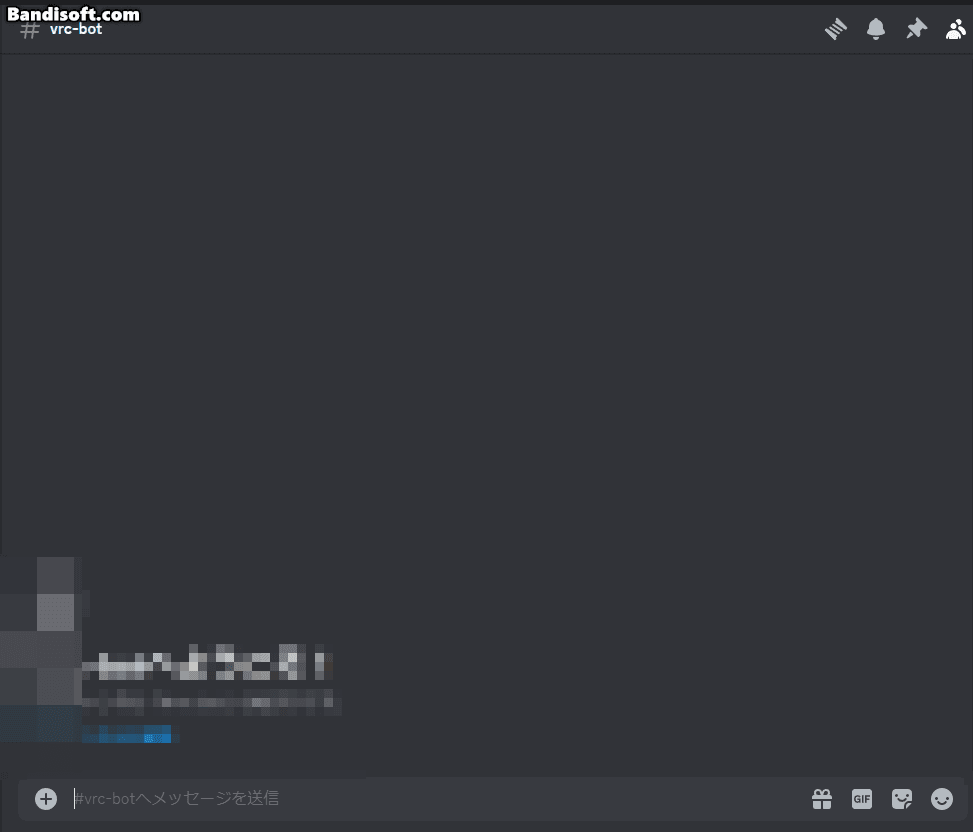
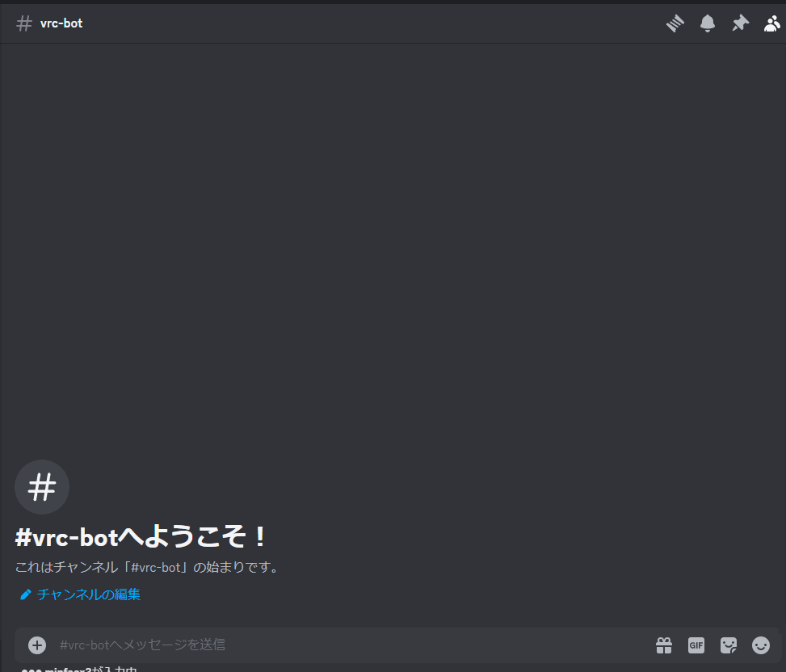

# vrc-discord-bot

  



## 概要
このアプリケーションはディスコード上でVRChatのフレンドのステータスやプロフィールをカードで確認できるbotです。  
今後カード内容の充実,ワールドとグループ関連の機能も追加する予定です。

## 導入方法
0. 本リポジトリをダウンロードする
1. .envファイルをリポジトリ直下に準備する。記載すべき内容は以下の通り
```
BOT_TOKEN=Discordボットのトークン
NAME=VRCのユーザー名
PASS=VRCのパスワード
USER_AGENT=アプリケーション名/バージョン メールアドレス
```
`USER_AGENTの例`：`vrc-discord-bot/1.0 mail@example.com`
2. リポジトリ直下でアプリケーションを実行（`go run main.go`）します。
3. ログインが試行されます。2要素認証が有効な場合はコードの入力を要求します。
```
Get environment data...
Try login to VRChat...
Enter 2FA code:
```
4. ログインに成功すると以下が表示されます。起動完了です。
```
Successfully logged in
Bot is now running.  Press CTRL-C to exit.
```

## 使用方法
現在対応しているコマンドは3つです。  
※プレフィックスではなくスラッシュコマンドでボットを呼び出すように変更する予定です。
* `!vrcbot ShowCurrentUser`
  * 自分自身の情報を表示します。

* `!vrcbot ShowOnlineFriend`
  * オンラインのフレンドが表示されるのでその中から詳細情報を確認したいフレンド名を選択するとそのフレンドのカードが表示されます。
* `!vrcbot ShowOfflineFriend`
  * オフラインのフレンドが表示されるのでその中から詳細情報を確認したいフレンド名を選択するとそのフレンドのカードが表示されます。

## フレンドカードの表示内容
|実装済み|内容|補足|
|:--:|:--:|:--|
|&#x2714;|ID||
|&#x2714;|Name|表示名|
|&#x2714;|Icon|アイコン|
|&#x2714;|Avatar Thumbnail|アバター画像|
|&#x2714;|BIO|説明|
|&#x2714;|Status|ステータス|
|△|Location|位置　現在はワールドIDが表示されるのでワールド名に変更予定|
|&#x2714;|Tag Language|言語タグ|
||Tag Social|ソーシャルタグ|
||Tag Others|その他タグ|
||Badge|バッジ|
|&#x2714;|Trust Rank|トラストランク　カードの色はトラストランクの色|
|&#x2714;|Last login date-time|最終ログイン日時|


## 予定
* カードに表示する内容の追加
* メールアドレス以外の2要素認証に対応
* プレフィックスではなくスラッシュコマンドでボットを呼び出すように変更
* 各種VRChat用のAPIの追加
* ワールド関連の機能の追加
* グループ関連の機能の追加

## LICENSE
[MIT](LICENSE)

## 補足
全ての国、地域、組織または個人は法律を遵守する必要があります。
